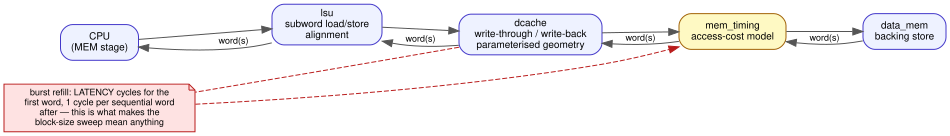
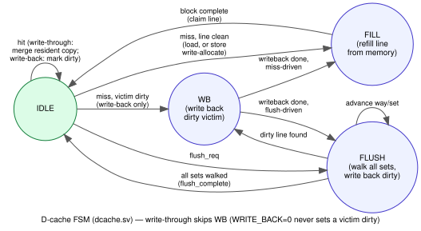

# Microarchitecture specification

## Overview and design goals

A 5-stage in-order RV32I pipeline optimized for **measurable trade-offs over raw performance**: every major design choice below has a cheaper or faster alternative that was deliberately not taken, and the point of the project is to state what it cost. It is not optimized for area, power, or clock frequency — the caches in particular don't yet fit the target device (see Synthesis) — and it deliberately does not implement interrupts, `FENCE.I`, or any extension beyond base RV32I.

## Pipeline organization

IF → ID → EX → MEM → WB, one instruction wide, in order. See the datapath diagram in the [README](../README.md#datapath) for the full block diagram, including both forwarding paths, the load-use stall path, and the next-PC priority mux.

- **IF**: PC → optional I-cache → `instr_mem`. Branch prediction (BTB + 2-bit counters) looks up in parallel with fetch and can redirect the *next* fetch speculatively.
- **ID**: decode (`control.sv`), register read (`reg_file.sv`, with a same-cycle write/read bypass), immediate generation.
- **EX**: ALU, branch/jump resolution, forwarding mux (EX/MEM and MEM/WB → EX).
- **MEM**: optional D-cache → `data_mem`; also the single commit point for traps, MRET, and CSR writes.
- **WB**: register file write-back.

Every pipeline register carries a `valid` bit end-to-end, so a flushed bubble is distinguishable from a genuinely-retired instruction at every stage — this is what makes the performance counters and precise exceptions exact rather than approximate.

## Major trade-offs, with their cost

Each entry: what was chosen, the alternative, what it costs, and the evidence.

### EX-resolve branches, not ID-resolve
**Chosen:** branches and jumps resolve in EX. **Alternative:** resolve in ID, which would cut the mispredict penalty from 2 cycles to 1. **Cost:** an ID-stage comparator on what's likely close to the critical path already, plus a second forwarding network feeding it (EX/MEM and MEM/WB values would need to reach ID, not just EX). **Evidence:** not isolated — fmax numbers now exist (see Synthesis), but only for the design as structured; no ID-resolve variant was built to compare against, so the specific claim "an ID comparator would cost X MHz" remains an argument, not a measurement. The 2-cycle penalty itself is directly measured: `bpred: mispredicts=N` in every test's perf counters, and the branch-predictor accuracy figures in the README's Performance section (80%+ on loop-heavy code) are the reason it doesn't dominate.

### Global pipeline freeze, not a decoupled front end
**Chosen:** any memory stall (`pipe_stall`) freezes the *entire* pipeline — PC, all four pipeline registers, the predictor, the CSR file, and the counters — for the cycle. **Alternative:** a fetch buffer between IF and ID would let the back end drain through an instruction-fetch miss instead of stalling on it. **Cost:** this is the single biggest structural limiter in the design (see `cpu.sv`'s `ponytail:` comment at the freeze mux). It inflates both the cached and uncached CPI numbers in the README's Performance section equally, so it doesn't fabricate a cache speedup, but it does mean the I-cache's measured benefit is somewhat inflated relative to what a decoupled front end would show — a D-cache miss currently stalls fetch too, which a real design would avoid. **Not implemented this pass**: a correct fetch-buffer redesign touches the freeze/flush/redirect priority logic this whole codebase's precise-exception and forwarding guarantees are built on, and validating it needs the lockstep golden model (blocked — see Limitations) as a regression net. Attempting it without one risks introducing exactly the kind of subtle pipeline bug the verification work in this pass was aimed at catching.

### Blocking caches, not hit-under-miss
**Chosen:** both caches are blocking — one outstanding miss stalls everything behind it. **Alternative:** a single MSHR would let independent hits proceed under a miss. **Cost:** simplicity (`dcache.sv`'s FSM is 4 states) against throughput lost to serialization; not quantified here for the same reason as above — it's downstream of the decoupled-front-end work.

### Write-through vs. write-back, both implemented and measured
**Chosen:** the D-cache supports both as a build-time parameter (`DCACHE_WRITE_BACK`), rather than picking one. **Cost:** none architecturally — this is the one trade-off in this list that's fully measured rather than argued about. The README's Performance section has the actual numbers: write-back wins on `sort` (2.25 → 1.25 CPI at 1KB) but *loses* to write-through on `matmul` at 256B/1KB, crossing over at 4KB. The comparison is somewhat unfair to write-through as implemented (no write buffer — every store pays full backing-memory latency), which the improvement plan flags as a natural next measurement; not done this pass.

### FIFO victim selection, not LRU
**Chosen:** both caches use a simple round-robin/FIFO victim pointer per set (`ponytail:` comments in `icache.sv` and `dcache.sv`). **Alternative:** true LRU. **Cost:** for the associativities actually swept in this project (1-4 way), the plan predicts the difference is usually small for a 2-way cache — that's a real, cheap-to-run finding this pass didn't get to. Not measured here.

### Single MEM commit point for precise exceptions
**Chosen:** every control-flow-changing exceptional event (trap, MRET, CSR write) resolves at one point, in MEM, in program order. **Alternative:** none seriously — this is what makes the exception model precise "for free" (see `cpu.sv`'s commit-point comment) rather than needing a reorder buffer. **Cost:** none beyond what precise exceptions cost anywhere: the offending and every younger instruction must be flushable, which is why `valid` is threaded through every pipeline register. This is the foundation the 13 SVA assertions and the directed exception tests (`t09`–`t15`) check.

### BTB-gated prediction (never predicts taken until a first taken hit)
**Chosen:** a branch is only ever predicted taken after the BTB has already recorded a taken outcome for it — the first execution of any branch is always predicted not-taken. **Cost:** every branch pays a guaranteed misprediction on its first taken occurrence; measured indirectly in the `bpred: accuracy=` figures already reported per test/kernel.

### A structural read-only-CSR convention, not a hand-maintained permission table
**Chosen:** CSR write permission is derived from address bits `[11:10] == 2'b11` (the standard RISC-V convention), rather than a per-CSR read/write flag. **Cost:** none found — this is a case where following the spec's own structural convention was strictly simpler than the alternative, not a trade-off with a real downside.

## Hazard and exception model

- **Data hazards**: EX/MEM and MEM/WB forwarding cover same-register producer/consumer pairs at distance 1 and 2; load-use (distance-1 dependency on a load, which forwarding can't fix because the value doesn't exist yet at EX) is caught by `hazard_detect.sv` and resolved with a one-cycle stall. See the load-use timing diagram in the README.
- **Control hazards**: predicted speculatively in IF; resolved in EX. A misprediction squashes IF/ID and ID/EX (the two younger in-flight instructions) — see the mispredict timing diagram in the README.
- **Exceptions**: illegal instruction, misaligned load/store, misaligned fetch (taken branch/JAL to a non-4-byte-aligned target), `ECALL`/`EBREAK`, and illegal CSR access (unimplemented address, or a write to a structurally read-only one) are all detected in EX and committed at the MEM commit point — see the trap timing diagram in the README. `mepc`/`mcause`/`mtval` are set on entry; `MRET` restores `mepc` as the redirect target. There is no `mstatus.MIE`/`MPIE`/`MPP` stack — see Limitations.
- **Priority** (next-PC mux, highest to lowest): memory-stall freeze > trap/MRET commit > EX misprediction recovery > load-use stall > front-end predicted-taken redirect > sequential.

## Memory hierarchy

`lsu.sv` handles RV32I subword load/store semantics (sign/zero extension, byte-enable generation); `dcache.sv`/`icache.sv` hold geometry and policy; `mem_timing.sv` is the backing-memory access-cost model everything above scales against. The burst-refill discount it models (full `LATENCY` for the first word of a block, 1 cycle per sequential word after) is what makes the block-size sweep in the README's Performance section mean anything — without it, every block size above one word would look strictly worse, which would be an artifact of the model, not a property of caches.

## Performance results

See the README's [Performance](../README.md#performance) section for the full CPI table and the three sweep findings (block-size/hit-rate inversion, write-back's non-uniform win, and `llist`'s non-monotonic block-size behavior).

## Synthesis

Out-of-context synthesis and implementation (synth → opt → place → route) on a real Vivado 2025.2 toolchain, target `xc7a35ticsg324-1L` (Arty A7-35T), a 2ns (500MHz) clock constraint deliberately unachievable so the reported worst negative slack is the useful data point: fmax = 1 / (period − WNS). Build scripts: [`syn/build.tcl`](../syn/build.tcl), [`syn/cpu.xdc`](../syn/cpu.xdc). Backing memories are sized down to 512 words each for this study (2KB instr + 2KB data via the `IMEM_DEPTH_WORDS`/`DMEM_DEPTH_WORDS` parameters) — resource/timing analysis doesn't need the full 2MB/64KB simulation-default footprint, and the full footprint doesn't fit this device regardless (see below).

| Config | Result | fmax | LUT | FF | BRAM |
|---|---|---|---|---|---|
| core only (no caches) | Routed | ~79 MHz | 3,990 / 20,800 (19%) | 4,966 / 41,600 (12%) | 0 / 50 |
| + 1KB I-cache (4-way) | Routed | ~77 MHz | 10,530 / 20,800 (51%) | 14,891 / 41,600 (36%) | 0 / 50 |
| + 4KB D-cache, write-through | **Doesn't fit** | — | 65,724 (316%) | 54,344 (131%) | 0 / 50 |
| + 4KB D-cache, write-back | **Doesn't fit** | — | 66,896 (322%) | 54,344 (131%) | 0 / 50 |

Three real findings, not predictions:

**Nothing here uses a Block RAM.** All four configs report 0/50 BRAM. `instr_mem.sv`/`data_mem.sv` and both caches' data arrays read combinationally (`assign x = mem[addr]`, no registered read), which Xilinx's synthesis can't map to a BRAM primitive — it falls back to distributed RAM (LUT-based) or, once the array gets large or is read through additional muxing (a cache's multi-way hit path), plain flip-flops. This is exactly the risk the improvement plan flagged going in; it's now measured rather than hypothesized.

**The I-cache alone costs ~10,000 flip-flops** (4,966 → 14,891) for a 1KB, 4-way cache — its data array (1KB ÷ 4 ways ÷ 4-word blocks = 16 sets × 4 ways × 4 words × 32 bits ≈ 8,192 bits of *storage*) is landing in flip-flops rather than the ~8Kbit it should cost in a single Block RAM tile, an order of magnitude waste driven by the same unregistered-read problem.

**The D-cache doesn't fit the device at all**, regardless of backing-memory size — LUT-as-Logic requirement barely moved (65,468 → 65,724 when backing memory shrank from 24,576 to 1,024 words), confirming the D-cache's own combinational multi-way tag/data/hit logic is the actual resource cost, not the plain memories. At 316% of the LUT budget, this isn't a "somewhat over" result; the D-cache as currently structured needs the registered-BRAM rework the improvement plan calls "the real work" of this phase before it can target this device at all.

One honest caveat: the reported critical paths (`report_timing`'s worst-path listings) show a source/destination pairing — e.g. a performance-counter register driving into the PC register — that isn't a real architectural dependency. This is very likely an artifact of out-of-context synthesis with a dozen `perf_*`/`dbg_*` outputs that don't feed anything beyond the module boundary, giving the optimizer freedom to share resources in ways that produce confusing endpoint names. The fmax *numbers* are real (they're what the implemented netlist's static timing analysis actually computed), but attributing the specific bottleneck to a named stage (as opposed to "the general unregistered-memory-read pattern measured above") would be overclaiming past what this data supports. A synthesis run with the perf/debug ports genuinely connected to something (a real SoC integration, or at minimum a register slice deliberately intended to consume them) would give cleaner attribution.

Revised reading of the CPI table in light of this: the README's speedup numbers were always stated as CPI upper bounds pending an fmax figure. With one now measured, the honest fmax-adjusted comparison is unfavorable to caching as currently implemented — the core alone (~79MHz) is faster than the I-cache config (~77MHz) even before accounting for the D-cache not fitting at all, so a cache's CPI win does not currently translate into a net throughput win on this device. That's not evidence caching is a bad idea; it's evidence the *cache array's synthesis strategy* (unregistered reads) needs to change before its CPI benefit can be measured against a fair frequency, exactly the trade this document's Memory hierarchy section already predicted qualitatively.

## Verification summary

See [`docs/VERIFICATION_PLAN.md`](VERIFICATION_PLAN.md) for the full breakdown. In one line each:

- 15 directed tests + 38/38 compliance tests, both run across a 6-configuration cache/latency CI matrix (66+114 test executions per push).
- 13 SVA properties, checked on every cycle of every test and benchmark run.
- 38 functional cover points (`cover property`, the supported stand-in for covergroups on this toolchain); 25/38 (65.8%) hit by the directed suite alone.
- Constrained-random regression (`make soak`) against a small Python golden model, 1000/1000 seeds clean on both cacheless and cache-enabled builds — scoped to the ALU/load-store subset (see Limitations).

## Known limitations and future work

Kept in the same honest tone as the README's Notes section, because a list like this is worth more than it costs to write:

- **Caches don't fit the target device yet.** See the Synthesis section above — the core and I-cache route cleanly (~77-79MHz), but the D-cache configuration is 3.2x over the Arty A7-35T's LUT budget, because none of the backing memories or cache data arrays infer Block RAM (unregistered/combinational reads throughout). This is a real, measured blocker, not a hypothetical one; fixing it (registered reads, one cycle of hit-determination latency) is real RTL work that needs re-verification against the full test suite before it can be trusted, and wasn't attempted this pass. Every trade-off above that says "not quantified here" beyond what's now in the Synthesis section is still waiting on a design that actually closes timing/fits.
- **No Spike lockstep.** The largest single verification upgrade available (instruction-by-instruction comparison against an independent reference, catching "right answer via the wrong path" bugs that final-state comparison structurally can't) is blocked the same way — Spike needs a build toolchain (device-tree-compiler, boost) this sandbox has no root to install. The constrained-random regression's Python golden model is a partial, ALU/load-store-only substitute.
- **No decoupled front end, no non-blocking caches, no store buffer.** All three are real, well-understood next steps (10b/10c in the improvement plan) but each is a significant redesign of the freeze/flush/redirect logic this pass's verification work was built to protect; none were attempted without the lockstep regression net to validate them against.
- **No interrupts.** `mie`/`mip`/`mtime`/`mtimecmp` and `mstatus.MIE`/`MPIE`/`MPP` don't exist. Synchronous exceptions are precise and fully tested; nothing asynchronous is implemented.
- **No `FENCE.I`.** Decodes as a no-op. Self-modifying or dynamically-loaded code can observe stale instructions after a store to code space.
- **No AXI wrapper.** The bespoke `req`/`burst`/`ready` memory-port protocol works but isn't the industry-standard interface an SoC integration would expect.
